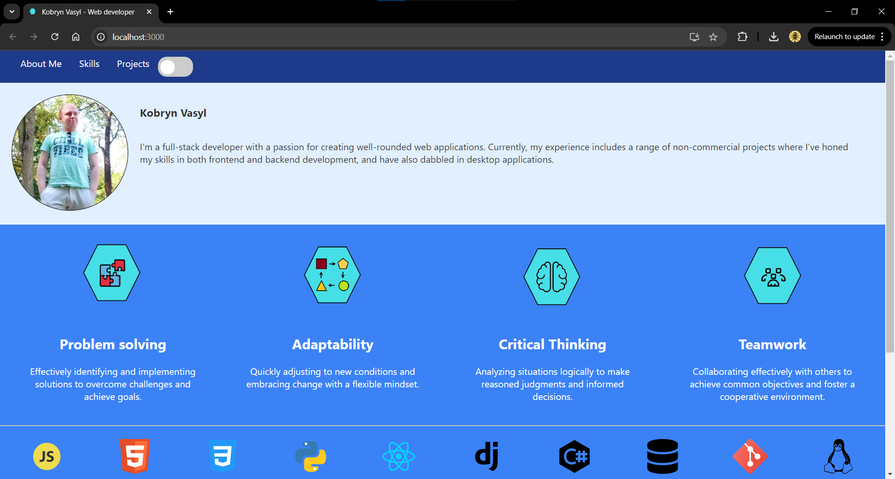

# Portfolio

# Table of Contents

- [Portfolio](#portfolio)
- [Table of Contents](#table-of-contents)
  - [Description](#description)
  - [Installation](#installation)
    - [1. Clone the Repository](#1-clone-the-repository)
    - [2. Create virtual enviroment for python](#2-create-virtual-enviroment-for-python)
    - [3. Run backend server](#3-run-backend-server)
    - [4. Run frontend server](#4-run-frontend-server)
  - [Contributing](#contributing)
  - [License](#license)

## Description

[Portfolio Website](https://vasya-556.github.io/portfolio/)  
This is a personal portfolio web application built using ReactJS and Django. The portfolio showcases a header, a footer, a skills section, and a projects section. Each project includes a brief description and links to live demos(if available) or repositories.


## Installation

Follow these steps to get started
### 1. Clone the Repository
```bash
git clone https://github.com/Vasya-556/portfolio.git
cd petshop
```

### 2. Create virtual enviroment for python
```bash
python -m venv env
# On Windows
env\Scripts\activate
# On macOS/Linux
source env/bin/activate
cd backend
pip install -r requirements.txt
```

### 3. Run backend server
```bash
cd backend
python manage.py migrate
python manage.py runserver
```

### 4. Run frontend server
```bash
cd frontend
npm start
```

## Contributing

Pull requests are welcome.

## License

[MIT](LICENSE)